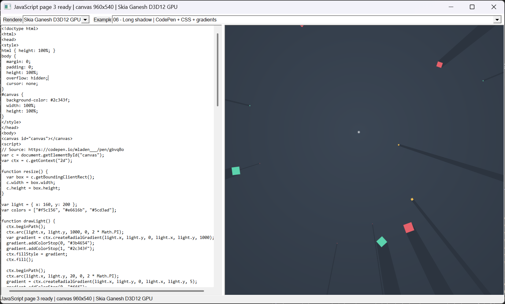

# GPU Canvas 2D Demo

This project is a small HTML Canvas 2D runtime for Windows. It runs JavaScript with QuickJS-ng,
records Canvas operations, and renders them through dynamically loaded GPU backends.

**Project website:** [herbertyeung.github.io/gpu-canvas2d](https://herbertyeung.github.io/gpu-canvas2d/)

[](https://herbertyeung.github.io/gpu-canvas2d/)

The application has a source editor on the left and a live render surface on the right. Editing a
valid page replaces the running page immediately. A syntax or runtime error leaves the last valid
page on screen.

## Rendering pipeline

```text
HTML and JavaScript
  -> QuickJS-ng
  -> Canvas 2D bindings and requestAnimationFrame
  -> CanvasFrame operations
  -> renderer plugin ABI v4
       |- Direct3D 12 rectangle renderer
       `- Skia Ganesh Direct3D 12 renderer
  -> D3D12 swap chain
```

The executable does not link to Skia or D3D12 rendering code directly. It discovers renderer DLLs
from the `renderers` directory at startup and can switch between them while running.

## Renderers

### Skia Ganesh D3D12 GPU

This is the main Canvas renderer. It creates a Ganesh Direct3D 12 context and a GPU-backed
`SkSurface`. Ganesh and the compositor share the same D3D12 adapter, device, queue, and texture.
There is no CPU raster fallback and no per-frame pixel readback or RGBA upload.

Supported features include:

- `fillRect`, `strokeRect`, and `clearRect`
- paths built with `moveTo`, `lineTo`, `arc`, and `closePath`
- path fill and stroke
- transforms, `save`, and `restore`
- premultiplied alpha
- `source-over` and `lighter` composition
- shadows and blur
- radial gradients and color stops
- persistent Canvas contents for trails and fades

Startup prints the active backend:

```text
Skia backend: Ganesh Direct3D 12 GPU
```

### Direct3D 12

The direct backend is a smaller renderer used to show how recorded Canvas operations become D3D12
instances and batches. It supports animated solid `source-over` `fillRect` pages that replace the
full Canvas each frame.

It also handles logical Canvas-to-window scaling and keeps the last frame visible while animation
is paused. Paths, shadows, gradients, additive blending, and persistent trails are intentionally
left to Skia.

The first built-in example can run on this backend. Examples that need more features switch to Skia
automatically.

## User interface

The toolbar contains two lists:

- **Renderer** selects the active renderer DLL.
- **Example** loads a complete HTML and JavaScript page into the editor.

Built-in examples are ordered by complexity:

1. **Pulse** — `fillRect` and `requestAnimationFrame`
2. **Bounce** — position, velocity, and shadows
3. **Orbit** — transforms and stroked paths
4. **Trails** — persistent pixels and additive blending
5. **Neon lines** — objects, HSL colors, resize handling, and shadows
6. **Long shadow** — CSS Canvas sizing, radial gradients, pointer input, and polygon shadows

The Long shadow example is adapted from Mladen Stanojevic's CodePen:
https://codepen.io/mladen___/pen/gbvqBo

Manual edits change the Example selection to `Custom - edited source`. A page loaded with
`--html-canvas` appears as `Custom - external HTML file`.

## JavaScript and browser bindings

QuickJS-ng runs classic `<script>` blocks. The browser shim currently provides:

- `window`, `self`, and `document`
- `document.getElementById()` and `document.querySelector("canvas")`
- legacy named Canvas properties such as `window.canvas`
- `requestAnimationFrame()` and `cancelAnimationFrame()`
- `performance.now()`
- `console.log()`, `console.warn()`, and `console.error()`
- `window.addEventListener()`, `window.onresize`, and Canvas mouse movement
- Canvas width and height setters
- `canvas.getBoundingClientRect()`

Script execution is bounded to keep the UI responsive. Page initialization has a 50 ms budget and
each animation frame has an 8 ms JavaScript budget. A page that times out is stopped until the
source is replaced.

## HTML and CSS scope

The loader accepts one `<canvas>`, one classic `<script>`, and an optional `<style>` block. It is not
an HTML layout engine.

The CSS parser only handles the rules needed by the Canvas examples:

- `canvas` or `#<canvas-id>` selectors
- `width: 100%`
- `height: 100%`
- `background` and `background-color`

Common body reset rules may remain in a page, but they do not create a general DOM layout tree.

## Requirements

- Windows 10 or Windows 11
- A hardware adapter with Direct3D 12 support
- Visual Studio 2026 with Desktop development with C++
- Windows SDK
- CMake 3.24 or newer
- vcpkg with `VCPKG_ROOT` set to its installation directory

The supplied preset uses the `Visual Studio 18 2026` generator and builds x64 binaries. WARP is not
used as a fallback.

## Dependencies

QuickJS-ng and Skia are declared in `vcpkg.json`. The Skia package enables its Direct3D feature,
which provides the Ganesh Direct3D 12 backend used by the main renderer. The manifest pins the
vcpkg baseline so that clean builds use the dependency versions tested by this project.

Set `VCPKG_ROOT` before configuring:

```powershell
$env:VCPKG_ROOT = 'C:\path\to\vcpkg'
```

The first configure automatically restores and builds the manifest dependencies under
`build/vcpkg_installed`. A first Skia build can take considerably longer than later builds. The
result must contain both Debug and Release Skia DLLs; required runtime DLLs are copied next to the
Skia renderer plugin after the build.

## Build

Configure the single build directory:

```powershell
cmake --preset default
```

Build Debug:

```powershell
cmake --build --preset debug -- /m
```

Build Release:

```powershell
cmake --build --preset release -- /m
```

All generated files stay under `build/`:

```text
build/
  bin/
    Debug/
      gpu_2d_demo.exe
      gpu2d_tests.exe
      renderers/
        gpu2d_renderer_d3d12.dll
        gpu2d_renderer_skia.dll
    Release/
      ...
```

`CMAKE_SUPPRESS_REGENERATION` is enabled to avoid Visual Studio's `ZERO_CHECK` project. Run
`cmake --preset default` again after changing `CMakeLists.txt` or `CMakePresets.json`.

## Run

Debug:

```powershell
.\build\bin\Debug\gpu_2d_demo.exe
```

Release:

```powershell
.\build\bin\Release\gpu_2d_demo.exe
```

Load an external page:

```powershell
.\build\bin\Debug\gpu_2d_demo.exe `
  --html-canvas .\examples\js_canvas_particles.html
```

Useful options:

| Option | Description |
|---|---|
| `--frames N` | Exit after N rendered frames |
| `--reload-at N` | Reload the active renderer after frame N |
| `--no-vsync` | Present with interval zero |
| `--html-canvas PATH` | Load a complete HTML and JavaScript Canvas page |
| `--debug-layer` | Request the optional D3D12 SDK validation layer |
| `--live-edit-self-test` | Exercise the editor change and page replacement path |
| `--renderer-self-test` | Render with D3D12, then switch to Skia |
| `--example-self-test` | Load the most complex built-in example and verify renderer routing |
| `--help` | Print command-line help |

Keyboard controls:

| Key | Action |
|---|---|
| `F5` | Re-run the current editor source |
| `Space` | Pause or resume animation |
| `R` | Reload the active renderer plugin |
| `Escape` | Exit |

## Tests

Tests are built as a normal executable rather than a CTest project:

```powershell
.\build\bin\Debug\gpu2d_tests.exe
.\build\bin\Release\gpu2d_tests.exe
```

The test executable covers HTML extraction, all built-in examples, Canvas state recording, RAF
ordering and cancellation, gradients, HSL colors, resize and pointer handlers, page errors, and
execution timeouts.

Runtime checks:

```powershell
.\build\bin\Debug\gpu_2d_demo.exe --renderer-self-test --no-vsync
.\build\bin\Debug\gpu_2d_demo.exe --example-self-test --no-vsync
.\build\bin\Debug\gpu_2d_demo.exe --live-edit-self-test --no-vsync
```

## Source layout

```text
include/gpu2d/            Public C++ interfaces
src/javascript_page.cpp  HTML loader, QuickJS runtime, and Canvas bindings
src/builtin_examples.cpp Built-in HTML and JavaScript examples
src/renderer_plugin_*.cpp Renderer DLL entry points
src/skia_rasterizer.cpp  Skia Ganesh D3D12 surface and Canvas execution
src/d3d12_renderer.cpp   D3D12 device, swap chain, resources, commands, and fences
src/frame_planner.cpp    Bounds, culling, and batching
src/win32_application.cpp Window, editor, controls, input, and frame loop
shaders/quad.hlsl        Direct renderer and compositor shader
tests/                   Standalone tests
```

CMake lists headers explicitly, so Visual Studio shows target-owned files under `Header Files`.

## Limits

This is a Canvas rendering demo, not a browser. It does not implement general DOM layout, full CSS,
network APIs, modules, workers, text rendering, image loading, or WebGL. JavaScript and rendering run
on the UI thread. The direct D3D12 backend is deliberately smaller than the Skia backend.

## Author

Hongtao Yang

GitHub: [herbertyeung](https://github.com/herbertyeung)
